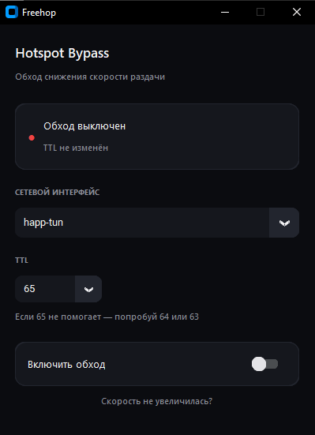

<div align="center">

# ⚡ Freehop

**Обход снижения скорости раздачи интернета на Windows**

[](https://www.python.org/)
[](#)
[](LICENSE)
[](https://github.com/TomSchimansky/CustomTkinter)



</div>

---

## Что это

Некоторые мобильные операторы режут скорость, когда раздают интернет с телефона на компьютер (hotspot throttling). Они определяют это по значению **TTL** в IP-пакетах — при прохождении через дополнительное устройство TTL уменьшается на 1.

**Freehop** маскирует TTL исходящих пакетов и подстраивает MTU, чтобы трафик с компьютера выглядел так же, как трафик с самого телефона.

## Возможности

- 🔘 Включение/выключение обхода одним переключателем
- 🌐 Автоматический выбор сетевого интерфейса — ничего не захардкожено
- 🎚️ Настраиваемый TTL (65 / 64 / 63 / 62) — под разных операторов
- 📋 Журнал с результатом каждой выполненной команды
- 💡 Подсказка, что делать, если скорость не выросла

## Установка

```bash
git clone https://github.com/<your-username>/freehop.git
cd freehop
pip install customtkinter
python hotspot_bypass.py
```

Приложение само запросит права администратора при запуске — они нужны для изменения реестра и сетевых параметров.

## Как пользоваться

1. Выбери сетевой интерфейс, через который идёт раздача
2. Выбери TTL (по умолчанию 65 — подходит для большинства случаев)
3. Включи переключатель
4. Переподключи Wi-Fi на устройстве, с которого раздаёшь интернет

Если скорость не увеличилась — нажми **«Скорость не увеличилась?»** в приложении или попробуй другое значение TTL.

## ⚠️ Дисклеймер

> Метод работает не всегда. Часть операторов детектит раздачу не по TTL, а по анализу самого трафика (DPI) — против этого TTL-спуфинг бессилен.
>
> Использование может нарушать условия тарифа. Автор не несёт ответственности за возможные последствия — используешь на свой риск. Проект сделан в образовательных целях.

## Стек

Python · [CustomTkinter](https://github.com/TomSchimansky/CustomTkinter) · `winreg` · `netsh`

## Лицензия

[MIT](LICENSE)

---

<div align="center">
<sub>Сделано, потому что операторы жадные 🙃</sub>
</div>
